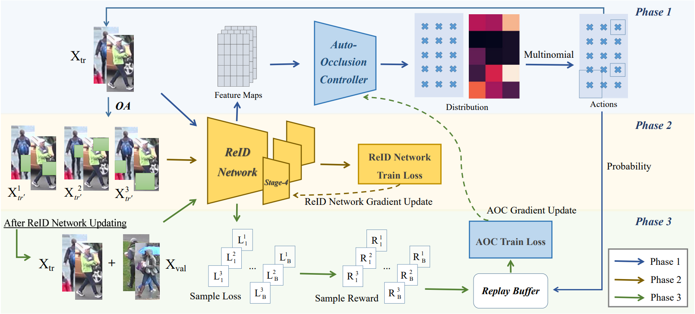

# 2023-TIP-CAAO

This is the pytorch implementation of the [paper]([https://ieeexplore.ieee.org/abstract/document/9397375](https://ieeexplore.ieee.org/document/10173750)) (accpted by IEEE TIP 2023).



**Fig 1**.CAAO framework

# Installation

Make sure [conda](https://www.anaconda.com/distribution/) is installed.

    # cd to your preferred directory and clone this repo
    git clone https://github.com/Vill-Lab/2023-TIP-CAAO
    cd 2023-TIP-CAAO-master
    
    # create environment
    conda create --name torchreid python=3.7
    conda activate torchreid
    
    # install dependencies
    # make sure `which python` and `which pip` point to the correct path
    python setup.py install


# Training
To train CAAO on Occluded-Duke, do

     python scripts/main.py --config-file configs/bfe.yaml --root 'your/dataset/folder'

## Citation 
If you find CAAO useful in your research, please consider citing.

```
@article{zhao2023content,
  title={Content-Adaptive Auto-Occlusion Network for Occluded Person Re-Identification},
  author={Zhao, Cairong and Qu, Zefan and Jiang, Xinyang and Tu, Yuanpeng and Bai, Xiang},
  journal={IEEE Transactions on Image Processing},
  year={2023},
  publisher={IEEE}
}
```

## Reference
This code is based on [torchreid](https://github.com/KaiyangZhou/deep-person-reid).
